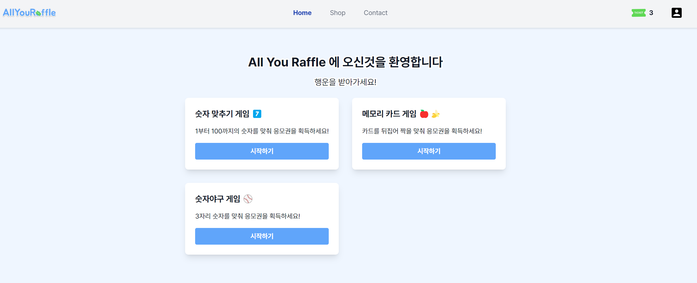
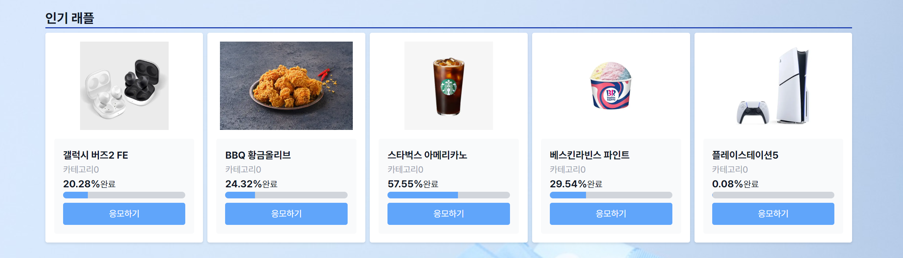

<br/>

<div align="center">
  
</div>

<h3 align="center">
    올유래플 응모상품
</h3>
<p align="center">

미니 게임을 통해 응모권을 얻어 다양한 상품에 응모할 수 있으며, 원하는 상품을 직접 결제하여 응모할 수 있습니다.
다양한 상품에 응모를 해보세요!

</p>

<br/>
<div align="center">
  
  
  
  
</div>

<br/><br />

## 배포 링크

### [https://allyouraffle.co.kr/](https://allyouraffle.co.kr/)

<br/><br/>

## 시작하기

### 설치 및 실행

```bash
git clone https://github.com/fastcam-sideproject/AllYouRaffle.git
```

```bash
npm install
```

```bash
npm run dev
```

<br/><br/>

## 사용한 기술

<table>
  <tbody>
    <tr>
     <td align="center" valign="middle">
        <div>
          
          
          <p align="center">
            Next.js
          </p>
        </div>
      </td>
      <td align="center" valign="middle">
        <div>
          
          
          <p align="center">
            TypeScript
          <p>
        </div>
      </td>
      <td align="center" valign="middle">
        <div>
          
          
          <p align="center">
            Webpack
          </P>
        </div>
      </td>
      <td align="center" valign="middle">
        <div>
          
          
          <p align="center">
            TailwindCSS
          </p>
        </div>
      </td>
      <td align="center" valign="middle">
        <div>
          
          
          <p align="center">
            Zustand
          </p>
        </div>
      </td>
    </tr>
    <tr>
      <td align="center" valign="middle">
        <div>
          
          
          <p align="center">
            Git
          </p>
        </div>
      </td>
      <td align="center" valign="middle">
        <div>
          
          
          <p align="center">
            Husky
          </p>
        </div>
      </td>
      <td align="center" valign="middle">
        <div>
          
          
          <p align="center">
            Eslint
          </p>
        </div>
      </td>
      <td align="center" valign="middle">
        <div>
          
          
          <p align="center">
            Prettier
          </p>
        </div>
      </td>
    </tr>
  </tbody>
</table>

<br/><br/>
